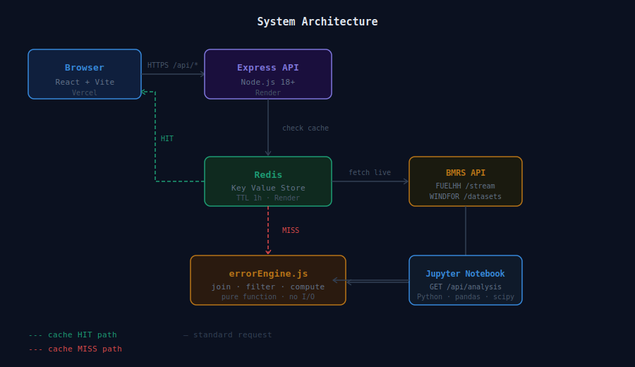
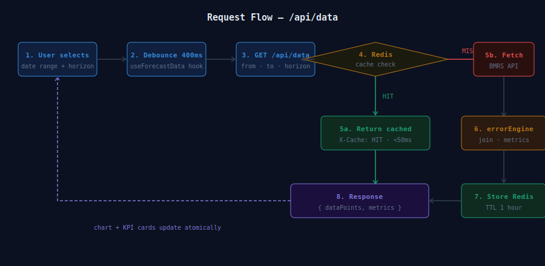
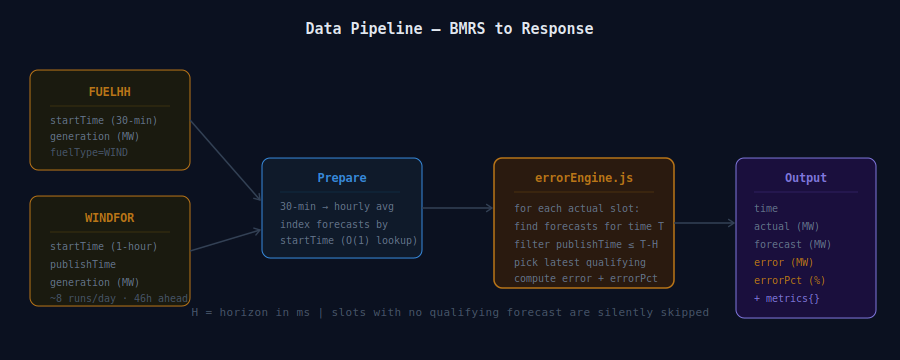
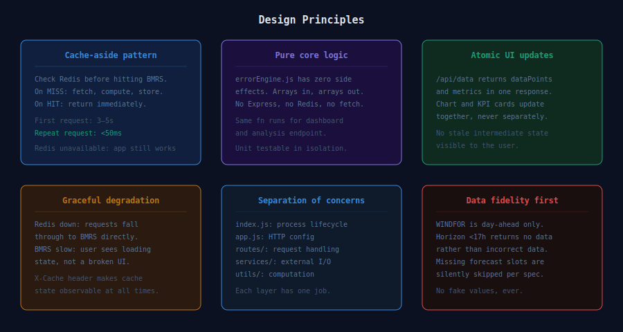

# Wind Forecast Monitor

A full-stack application for monitoring the accuracy of UK national wind power generation forecasts, built against the publicly available BMRS (Balancing Mechanism Reporting Service) API published by Elexon.

**Live application:** [wind-app.vercel.app](https://wind-app.vercel.app)  
**API health check:** [wind-app.onrender.com/api/health](https://wind-app.onrender.com/api/health)

---

## Table of Contents

- [Problem Statement](#problem-statement)
- [Features](#features)
- [Architecture](#architecture)
- [Request Flow](#request-flow)
- [Data Pipeline](#data-pipeline)
- [Design Principles](#design-principles)
- [Tech Stack](#tech-stack)
- [Project Structure](#project-structure)
- [Environment Variables](#environment-variables)
- [Running Locally](#running-locally)
- [API Reference](#api-reference)
- [Deployment](#deployment)
- [Analysis Findings](#analysis-findings)
- [Future Improvements](#future-improvements)
- [AI Tooling Disclosure](#ai-tooling-disclosure)

---

## Problem Statement

BMRS publishes two wind-related datasets:

- **FUELHH** — actual half-hourly wind generation, recorded after delivery
- **WINDFOR** — day-ahead wind generation forecasts, published approximately 8 times per day, each covering ~46 hours ahead

These datasets exist independently. There is no built-in tool to join them, measure forecast accuracy over time, or understand how the forecast model behaves across different operating conditions.

This project solves that. It joins actuals with forecasts on `startTime`, computes error metrics at each hourly slot, and presents the results as an interactive monitoring dashboard. A companion Jupyter notebook performs deeper statistical analysis and produces a grid planning recommendation.

---

## Features

- Select any date range and forecast horizon (17–48h) — data fetched live from BMRS
- Dual-line chart showing actual vs. forecasted generation with colour-coded error shading
- KPI cards: MAE, max over-forecast, max under-forecast, P99 error
- Reliability badge showing the bootstrapped p10 generation floor for grid planning
- Redis caching layer — first request is live, repeat requests return in under 50ms
- Application remains functional if Redis is unavailable (graceful degradation)
- `X-Cache: HIT/MISS` header on all API responses for observability

---

## Architecture



The system is split into three independent deployments: a React frontend on Vercel, an Express API on Render, and a Redis Key Value store on Render. The frontend makes requests to the API; the API checks Redis before reaching out to BMRS.

---

## Request Flow



Every user interaction that changes the date range or horizon triggers a debounced API call. The server checks Redis first. On a cache hit, the response is returned immediately. On a miss, BMRS is fetched, the result is processed through `errorEngine.js`, stored in Redis, and returned. The chart and KPI cards receive a single response and update atomically.

---

## Data Pipeline



FUELHH returns 30-minute resolution data. WINDFOR returns hourly data. Before joining, actuals are aggregated into hourly averages so both datasets share the same time resolution. `errorEngine.js` then indexes forecasts by `startTime`, applies the horizon filter (only forecasts published at least H hours before the target slot qualify), and computes `error` and `errorPct` for each joined point.

---

## Design Principles



| Principle | Decision |
|---|---|
| Cache-aside | Redis checked before every BMRS call. Miss → fetch, compute, store. Hit → return immediately. |
| Pure core logic | `errorEngine.js` has no side effects — arrays in, arrays out. Same function powers the dashboard and the analysis endpoint. |
| Atomic UI updates | `/api/data` returns `{ dataPoints, metrics }` in one response. Chart and KPIs never show mismatched state. |
| Graceful degradation | Redis failure is non-fatal. Requests fall through to BMRS. `X-Cache` header makes this observable. |
| Separation of concerns | routes handle HTTP, services handle I/O, utils handle computation. Each layer has one job. |
| Data fidelity | Horizon values below 17h return no data rather than incorrect data. Missing forecast slots are skipped, not filled. |

---

## Tech Stack

**Server**
- Node.js 18+ with Express
- `ioredis` — Redis client with graceful fallback
- `express-rate-limit` — basic rate protection
- `compression` — gzip responses

**Client**
- React 19 + Vite 6
- Tailwind CSS v4 — `@tailwindcss/vite` plugin, no `tailwind.config.js` required
- Recharts — `ComposedChart` with dual lines and `ReferenceArea` error shading
- `react-datepicker` — date range selection
- `axios` + `date-fns`

**Infrastructure**
- Render — Express server + Redis Key Value store (same region, internal private network)
- Vercel — React frontend with automatic deploys on push to `main`

**Analysis**
- Python 3.10+, Jupyter Notebook
- `pandas`, `numpy`, `matplotlib`, `seaborn`, `scipy`

---

## Project Structure


```
wind-forecast-monitor/
├── server/
│   ├── index.js                  # process entry — calls app.listen()
│   ├── app.js                    # Express config, middleware, route mounting
│   └── src/
│       ├── routes/
│       │   ├── data.js           # GET /api/data
│       │   ├── metrics.js        # GET /api/metrics
│       │   ├── reliability.js    # GET /api/reliability
│       │   └── analysis.js       # GET /api/analysis
│       ├── services/
│       │   ├── bmrs.js           # live BMRS fetchers (FUELHH + WINDFOR)
│       │   └── cache.js          # ioredis wrapper with graceful fallback
│       └── utils/
│           └── errorEngine.js    # pure join + metrics computation
│
├── client/
│   ├── vite.config.js
│   └── src/
│       ├── pages/
│       │   └── Dashboard.jsx     # top-level layout and state wiring
│       ├── components/
│       │   ├── ForecastChart.jsx  # Recharts dual-line + error shading
│       │   ├── KpiCard.jsx        # metric display card
│       │   ├── DateRangePicker.jsx
│       │   ├── HorizonSlider.jsx  # 17–48h range
│       │   └── ReliabilityBadge.jsx
│       ├── hooks/
│       │   ├── useForecastData.js # central state, debounced API calls
│       │   └── useReliability.js  # fetches reliability data once on mount
│       └── utils/
│           ├── api.js             # axios client
│           └── formatters.js      # MW, %, datetime formatting
│
├── analysis/
│   ├── forecast_analysis.ipynb   # committed with outputs run
│   └── requirements.txt
│
└── public/                       # SVG diagrams referenced in this README
```

---

## Environment Variables

**Server** (`server/.env` — copy from `server/.env.example`)

| Variable | Description | Default |
|---|---|---|
| `PORT` | Port the Express server listens on | `3001` |
| `NODE_ENV` | Environment | `development` |
| `REDIS_URL` | Redis connection string | `redis://localhost:6379` |
| `CLIENT_URL` | Allowed CORS origin | `http://localhost:5173` |
| `BMRS_BASE` | BMRS API base URL | `https://data.elexon.co.uk/bmrs/api/v1` |
| `CACHE_TTL_SECONDS` | Redis TTL per cached response | `3600` |

**Client** (`client/.env.production`)

| Variable | Description |
|---|---|
| `VITE_API_URL` | Deployed server URL used in production builds |

---

## Running Locally

**Prerequisites:** Node.js 18+, Python 3.10+, Redis

**1. Start Redis**

```bash
redis-server
```

**2. Start the server**

```bash
cd server
npm install
cp .env.example .env
npm run dev
```

Server runs at `http://localhost:3001`. Verify with:

```bash
curl http://localhost:3001/api/health
```

**3. Start the client** (new terminal)

```bash
cd client
npm install
npm run dev
```

Client runs at `http://localhost:5173`. Vite proxies all `/api/*` requests to the server — no CORS configuration needed in development.

**4. Start the analysis notebook** (new terminal)

```bash
cd analysis
python -m venv venv

# Windows
venv\Scripts\activate

# macOS / Linux
source venv/bin/activate

pip install -r requirements.txt
jupyter notebook
```

Open `forecast_analysis.ipynb`. The notebook fetches data from your local server at `http://localhost:3001/api/analysis`.

---

## API Reference

All datetime parameters are ISO 8601 strings. Horizon is expressed in hours and defaults to `24`.

| Method | Endpoint | Parameters | Description |
|---|---|---|---|
| GET | `/api/health` | — | Server status and Redis connection state |
| GET | `/api/data` | `from`, `to`, `horizon` | Joined data points and computed metrics, Redis-cached |
| GET | `/api/metrics` | `from`, `to`, `horizon` | Metrics only (lighter payload) |
| GET | `/api/reliability` | — | p5 / p10 / p50 / p90 generation floors from Jan 2024 actuals |
| GET | `/api/analysis` | — | Full Jan 2024 joined dataset for the notebook |
| DELETE | `/api/cache` | — | Flush all Redis keys (development utility) |

**Example request**

```bash
curl "https://wind-app.onrender.com/api/data?from=2024-01-10T00:00:00Z&to=2024-01-17T00:00:00Z&horizon=24"
```

**Example response**

```json
{
  "dataPoints": [
    {
      "time": "2024-01-10T00:00:00.000Z",
      "actual": 7240,
      "forecast": 8100,
      "error": 860,
      "errorPct": 11.88
    }
  ],
  "metrics": {
    "mae": 1200,
    "maxOverForecast": 3900,
    "maxUnderForecast": -2959,
    "p99Error": 7016,
    "biasMW": 1253,
    "count": 169
  }
}
```

---

## Deployment

**Server → Render**

1. Create a new Web Service, connect your GitHub repository
2. Set Root Directory to `server`
3. Build command: `npm install`
4. Start command: `node index.js`
5. Add a Redis Key Value store in the same region, link it to the service (auto-injects `REDIS_URL`)
6. Add the remaining environment variables in the Render dashboard

**Client → Vercel**

1. Import the repository, set Root Directory to `client`
2. Framework preset: Vite
3. Add environment variable: `VITE_API_URL` = your Render server URL
4. Deploy

After deploying the client, update `CLIENT_URL` in the Render environment to your Vercel URL so CORS is correctly configured.

---

## Analysis Findings

Full statistical analysis is in `analysis/forecast_analysis.ipynb`.

**Finding 1 — Heteroscedasticity**

Forecast errors scale with generation magnitude (slope = 0.222, R² = 0.415). Hours where the forecast exceeds 12,000 MW carry errors **4.44× larger** than hours below 6,000 MW. The model is least reliable at precisely the moments when grid operators depend on wind most heavily.

**Finding 2 — Bootstrapped Reliability Floor**

10,000 bootstrap resamples of January 2024 actual generation produce a distribution of p10 estimates. The 95% confidence interval is **4,748 MW to 5,475 MW**. The conservative planning recommendation is **4,748 MW** — wind can be expected to deliver at least this amount in 90% of operating hours, and the confidence interval confirms this is not a single-month sampling artefact.

| Metric | Value |
|---|---|
| MAE | 2,000 MW |
| Median absolute error | 1,717 MW |
| Mean bias | +1,253 MW (systematic over-forecast) |
| P99 error | 7,016 MW |
| RMSE | 2,610 MW |
| Reliable floor — 95% CI lower | 4,748 MW |
| Reliable floor — 95% CI upper | 5,475 MW |
| Error growth factor (low vs high wind) | 4.44× |

---

## Future Improvements

- Error heatmap — hour-of-day × date grid showing where errors are worst (ECharts)
- Horizon degradation curve — MAE plotted against lead time to show where the model crosses from reliable to unreliable
- Extended date range — the application already supports any BMRS-available date; the analysis notebook could be extended beyond January 2024
- Automated cache warming — pre-populate Redis for common date ranges on server startup
- Unit tests for `errorEngine.js` — the pure function design makes this straightforward to add

---

## AI Tooling Disclosure

Claude (Anthropic), Gemini were used as a development assistant during the building of this project.